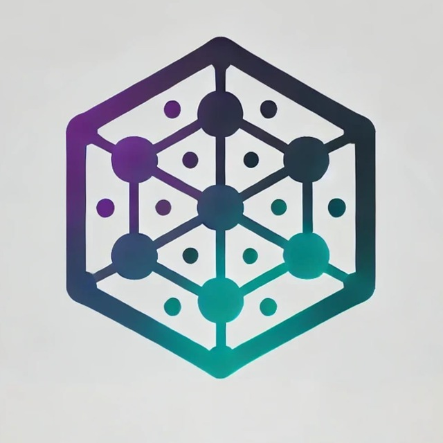

<p align="center">
  
</p>

<h1 align="center">ChainPortal</h1>
<p align="center">Your Gateway to Web3 Gaming 🎮</p>

<p align="center">
  <a href="https://discord.gg/chainportal">
    
  </a>
  <a href="https://twitter.com/chainportal">
    
  </a>
  <a href="https://docs.chainportal.com">
    
  </a>
</p>

## 🎯 Mission

ChainPortal empowers game developers to integrate NFT-based authentication seamlessly. We're building the infrastructure that makes Web3 gaming accessible, secure, and user-friendly.

## 🏗️ Infrastructure

| Repository                                                                  | Description                                                     |
| --------------------------------------------------------------------------- | --------------------------------------------------------------- |
| [chainportal-console](https://github.com/chainportal/chainportal-console)   | 🎛️ Developer console for managing API keys, NFTs, and analytics |
| [chainportal-sdk](https://github.com/chainportal/chainportal-sdk)           | 🛠️ React SDK for integrating NFT authentication                 |
| [chainportal-examples](https://github.com/chainportal/chainportal-examples) | 🎮 Example implementations and starter templates                |
| [chainportal-docs](https://github.com/chainportal/chainportal-docs)         | 📚 Official documentation and guides                            |

## ⚡ Quick Start

```bash
# Install the SDK
npm install @chainportal/sdk

# Add authentication to your React app
import { ChainPortalAuth } from '@chainportal/sdk';

function App() {
  return (
    <ChainPortalAuth
      apiKey="your_api_key"
      onSuccess={(user) => console.log('Authenticated:', user)}
    />
  );
}
```

## 🌟 Key Features

- 🎫 **One-Click Authentication**

  - Seamless NFT-based authentication
  - Automatic minting and airdropping
  - Web3 wallet integration

- 🛠️ **Developer Tools**

  - Comprehensive developer console
  - Real-time analytics
  - API key management

- 💎 **NFT Infrastructure**
  - Smart contract deployment
  - Cross-chain support
  - Account trading capabilities

## 📦 Example Apps

1. **Basic Authentication**

   - Simple React app with NFT authentication
   - [View Demo](https://demo.chainportal.com/basic)
   - [Source Code](https://github.com/chainportal/chainportal-examples/tree/main/basic)

2. **Game Marketplace**

   - NFT-based game account marketplace
   - [View Demo](https://demo.chainportal.com/marketplace)
   - [Source Code](https://github.com/chainportal/chainportal-examples/tree/main/marketplace)

3. **Unity Integration**
   - Unity game with ChainPortal authentication
   - [View Demo](https://demo.chainportal.com/unity)
   - [Source Code](https://github.com/chainportal/chainportal-examples/tree/main/unity)

## 🚀 Getting Started

Visit our [Developer Portal](https://console.chainportal.com) to:

1. Create an account
2. Generate API keys
3. Deploy NFT contracts
4. Monitor usage

## 📚 Documentation

- [Quick Start Guide](https://docs.chainportal.com/quick-start)
- [SDK Reference](https://docs.chainportal.com/sdk)
- [API Documentation](https://docs.chainportal.com/api)
- [Smart Contract Guide](https://docs.chainportal.com/contracts)

## 🌐 Supported Networks

- Ethereum Mainnet
- Polygon
- Binance Smart Chain
- Avalanche
- Arbitrum
- More coming soon!

## 💪 Community

- [Discord](https://discord.gg/chainportal) - Join our developer community
- [Twitter](https://twitter.com/chainportal) - Follow for updates
- [Blog](https://blog.chainportal.com) - Technical articles and news
- [YouTube](https://youtube.com/chainportal) - Tutorials and demos

## 🤝 Contributing

We welcome contributions to all our repositories! Check out our [contribution guidelines](CONTRIBUTING.md) to get started.

## 📬 Contact

- Email: support@chainportal.com
- Discord: [Join our server](https://discord.gg/chainportal)
- Twitter: [@chainportal](https://twitter.com/chainportal)

## 📜 License

All repositories under ChainPortal are licensed under the MIT License - see the [LICENSE](LICENSE) file in each repository for details.
